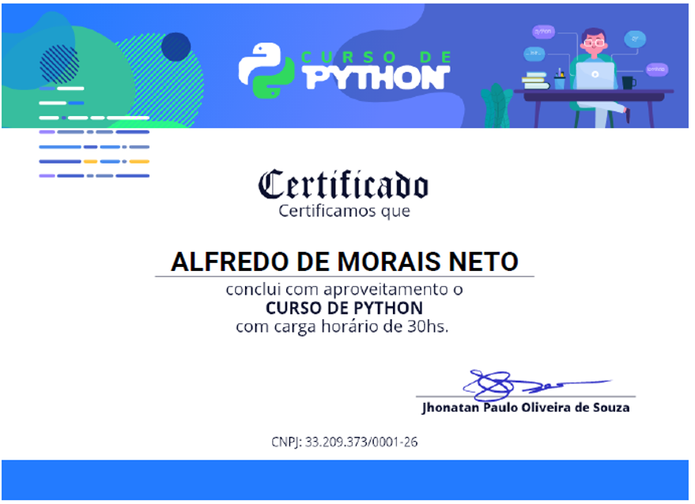

# Estudos em Python

## Objetivo: 
Este repositório tem como objetivo incluir trechos de codigos, estudos, algoritmos, desenvolvidos durante o processo de aprendizagem da linguagem de programação PYTHON. O estudo tem bases em livros mais conceituados no mundo da programação, cursos disponibilizado pela plataforma UDEMY, DATA SCIENCE ACADEMY e DEV APRENDER. 

## Estudos de Livros:
1. Curso Intensivo de Python: Uma introdução prática e baseada em projetos à programação (Eric Matthes)
2. Automatize Tarefas Maçantes com Python: Programação Prática para verdadeiros iniciantes (Al Sweigart)
3. Data Science do Zero: Primeiras Regras com o Python (Joel Grus)

## Certificados

## Alfredo de Morais | Desenvolvedor de Aplicações Python
