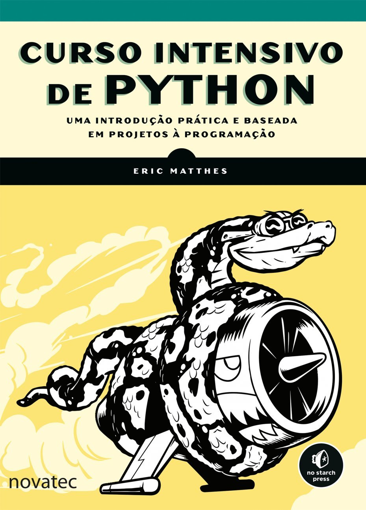
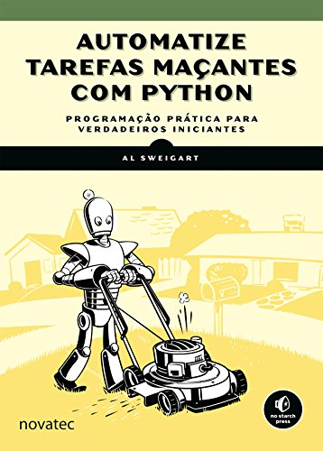
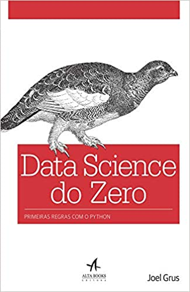
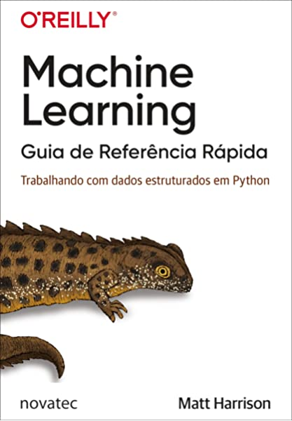

# Estudos em Python

## META:
Conseguir a transição de carreira para área de DESENVOLVIMENTO PYTHON - 100% REMOTO. 

## Objetivo: 
Este repositório tem como objetivo incluir trechos de codigos, estudos, algoritmos, desenvolvidos durante o processo de aprendizagem da linguagem de programação PYTHON. O estudo tem bases em livros mais conceituados no mundo da programação, cursos disponibilizado pela plataforma UDEMY, DATA SCIENCE ACADEMY, DEV APRENDER e entre outros. 

## Cursos de Python
1. Curso de Python 3 do Básico Ao Avançado (com projetos reais) - Luiz Otávio Miranda
2. Curso Pythonista Profissional Dev Aprender - Jhonatan Souza
3. Python Para Analise de Dados - Data Science Academy
4. Visualizações 2D e 3D com Python - Geek University
5. Django 3 - Python Backend Web Development - Kazi Ariyan
6. Django with React | An Ecommerce Web Site - Dennis Ivy
7. Tensor Flow: Machine Learning and Deep Learning com Python - Jones Granaty
8. Machine Learning e Data Science com Python - Jones Granaty
9. Data Science de A a Z - Felipe Mafra
10. Formação Engenheiro de Deep Learning e Machine Learning - Fernando Amaral

## Estudos de Livros:
1. Curso Intensivo de Python: Uma introdução prática e baseada em projetos à programação (Eric Matthes) 

2. Automatize Tarefas Maçantes com Python: Programação Prática para verdadeiros iniciantes (Al Sweigart) 

3. Data Science do Zero: Primeiras Regras com o Python (Joel Grus) 

4. Machine Learning - Guia de Referência Rápida (Matt Harrison)

## Certificados

## Alfredo de Morais | Desenvolvedor de Aplicações Python
