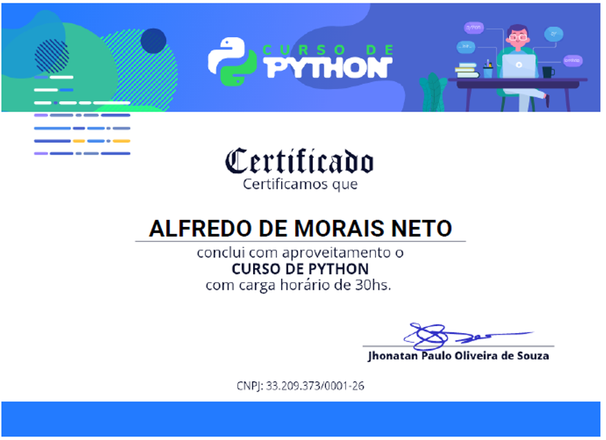

# Estudos em Python :snake: 

## META:
Conseguir a transição de carreira para área de DESENVOLVIMENTO PYTHON - 100% REMOTO. 

## Objetivo: 
Este repositório tem como objetivo incluir trechos de codigos, estudos, algoritmos, desenvolvidos durante o processo de aprendizagem da linguagem de programação PYTHON. O estudo tem bases em livros mais conceituados no mundo da programação, cursos disponibilizado pela plataforma UDEMY, DATA SCIENCE ACADEMY, DEV APRENDER e entre outros. 

## Cursos de Python

|Informações | Figura            |
|:---        | :---:             |
|Concluido   |:heavy_check_mark: |
|Não Iniciado|:white_circle:     |
|Cursando    |:large_blue_circle:|

|No.  | Descrição do Curso                                                               | Status            | (%) |
|:---:|:---                                                                              | :---:             |:---:|
|1    |Curso Pythonista Profissional Dev Aprender - Jhonatan Souza                       |:heavy_check_mark: | 100 |
|2    |Curso de Python 3 do Básico Ao Avançado (com projetos reais) - Luiz Otávio Miranda|:large_blue_circle:| 15  |
|3    |Estrutura de Dados e Algoritmos em Python - Jones Granaty                         |:large_blue_circle:| 0   |
|4    |Python Para Analise de Dados - Data Science Academy                               |:large_blue_circle:| 50  |
|5    |Visualizações 2D e 3D com Python - Geek University                                |:white_circle:     | 0   |
|6    |Django 3 - Python Backend Web Development - Kazi Ariyan                           |:large_blue_circle:| 15  |
|7    |Django with React An Ecommerce Web Site - Dennis Ivy                              |:white_circle:     | 0   |
|8    |Tensor Flow: Machine Learning and Deep Learning com Python - Jones Granaty        |:white_circle:     | 0   |
|9    |Machine Learning e Data Science com Python - Jones Granaty                        |:white_circle:     | 0   |
|10   |Data Science de A a Z - Felipe Mafra                                              |:white_circle:     | 0   |
|11   |Formação Engenheiro de Deep Learning e Machine Learning - Fernando Amaral         |:white_circle:     | 0   |

## Certificados

## Alfredo de Morais | Desenvolvedor de Aplicações Python
